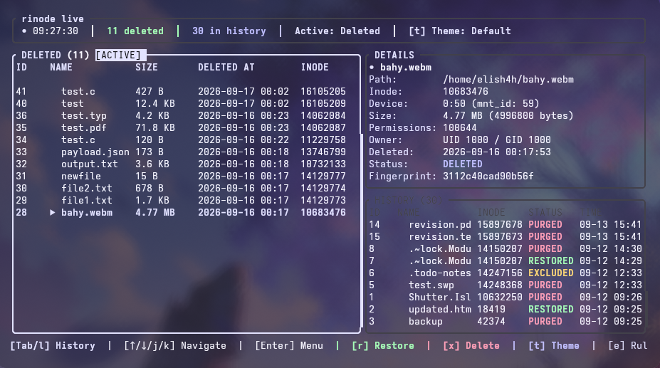
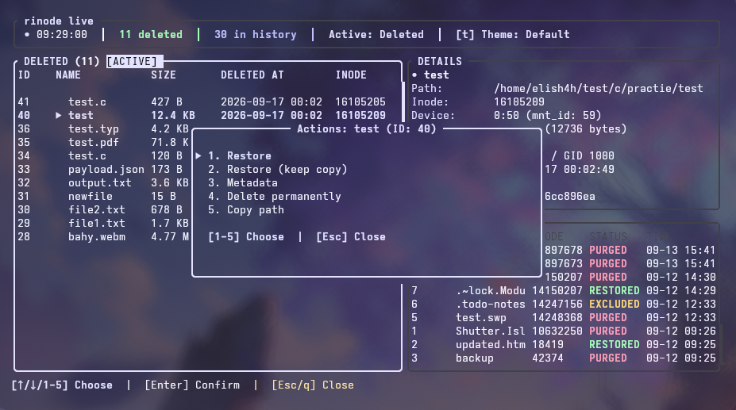
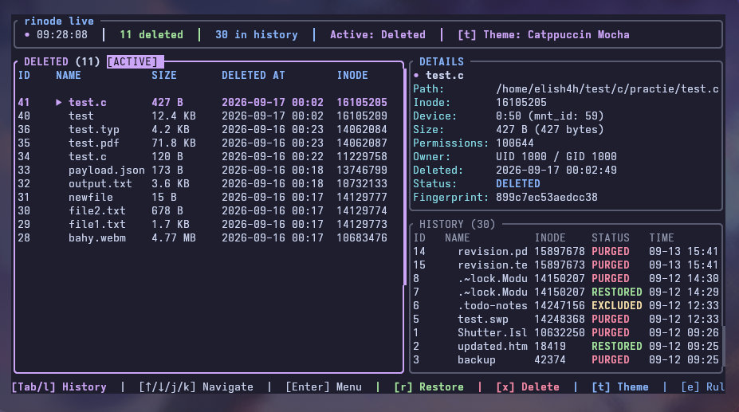
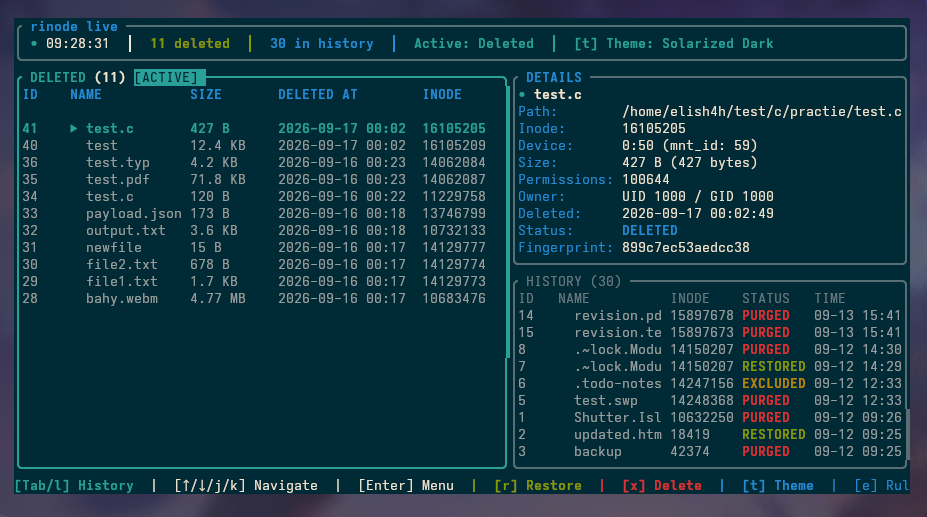

<div align="center">

# rinode

Zero-copy deleted file tracking and instant restoration for Linux

[](https://www.rust-lang.org)
[](https://kernel.org)
[](LICENSE)

</div>

---

`rinode` is a Linux utility that preserves deleted files and directories in constant time without copying data blocks, allowing instant restoration.

## Problem

Standard Linux deletion tools have two main drawbacks:

1. **Immediate extent tree deallocation**: When you delete a file with `rm`, the kernel drops the inode link count to zero. Filesystems like ext4 immediately clear the inode extent tree and mark blocks as free. Once that happens, undeleting requires scanning raw disk blocks with tools like `ext4magic` or `photorec`, which often fails for fragmented or large files.
2. **Slow cross-filesystem copies**: Desktop trash specifications (FreeDesktop Trash) copy files byte-by-byte when moving across mount points or subvolumes. Deleting a 50GB directory tree or large virtual machine image can take minutes and wastes write cycles.

## How it works

`rinode` keeps inodes alive at the filesystem level:

1. **Mount-boundary discovery**: It walks up the directory tree using `statx(2)` with `STATX_MNT_ID` to find the exact mount point or Btrfs subvolume root.
2. **Constant-time move**: It relocates deleted entries into a permissions-locked storage directory (`.rinode-storage`, mode `0700`) on the same filesystem using `renameat2(2)`. The inode number, extent tree, permissions, and timestamps stay intact on disk.
3. **Audit indexing**: Metadata (original path, inode, device ID, owner, permissions, and a 64KB xxHash fingerprint) is recorded into an embedded SQLite database (`rinode.db`) in Write-Ahead Log (WAL) mode.
4. **Instant restoration**:
   - **Move back (default)**: Recreates any missing parent directories (`mkdir -p`) and moves the inode back to its original location via `rename()`.
   - **Snapshot copy (`--keep-copy`)**: On filesystems that support Copy-on-Write (Btrfs, XFS), it issues an `ioctl(FICLONE)` system call to point a new directory entry to the existing data blocks with zero duplication. On ext4, it copies the file.

### Technical specification

For an in-depth systems document analyzing the Linux inode lifecycle, extent tree deallocation, VFS link count semantics, and atomic directory transaction flows:

- **[rinode Architecture & VFS Specification (PDF)](docs/whitepaper.pdf)**

## Installation

Requirements:
- Linux kernel 5.8 or newer (required for `STATX_MNT_ID`)
- Rust 1.75+ (for building from source)

### Building from source

```bash
make
```

### Systemwide installation

Installs the binary to `/usr/local/bin`, man page to `/usr/local/share/man/man1`, and shell completions for Fish, Bash, and Zsh:

```bash
sudo make install
```

### Local user installation

Installs to `~/.local/bin` and user completion directories:

```bash
make install-user
```

To uninstall:
```bash
sudo make uninstall
```

## Usage

### Interactive terminal dashboard

Running `rinode` without arguments opens a split-screen terminal interface:

```bash
rinode
```

<p align="center">
  
</p>

- **Left pane**: Table of deleted files (`DELETED`, ID, filename, size, deletion time, inode number).
- **Right pane**:
  - **Upper section (`DETAILS`)**: Inode metadata, permissions, ownership, deletion timestamp, 64KB content fingerprint, and storage path.
  - **Lower section (`HISTORY`)**: Audit table of previously restored, purged, and excluded files, with status and local timestamps.
- **Navigation & focus**:
  - `Tab` / `BackTab` or `h` / `l` (or arrow keys) toggle focus between Deleted Files and History.
  - `j` / `k` navigate rows within the active pane.
- **Actions**:
  - Press `Enter` on a deleted entry to open the action menu (Restore, Restore (keep copy), Metadata, Delete permanently, Copy path).
  - Press `Enter` on a file in history to inspect its metadata.
  - Quick keys: `r` to restore, `x` to delete permanently, `t` to cycle themes, `e` to view active exclusion rules, `q` to exit.

<p align="center">
  
</p>

### Built-in themes

`rinode` provides built-in color schemes matching modern terminal palettes. Press `t` in the dashboard to cycle through themes live, or set `theme` in your configuration file:

| Catppuccin Mocha | Solarized Dark |
|:---:|:---:|
|  |  |

Available themes:
- `default`: Preserves your terminal's transparent background with cyan/green accents.
- `catppuccin`: Catppuccin Mocha palette with mauve borders and sky-blue highlights.
- `solarized`: Solarized Dark palette with cyan borders and amber accents.
- `dracula`: Dracula theme with purple borders and green status indicators.
- `gruvbox`: Gruvbox Dark theme with bright orange and aqua accents.
- `tokyo_night`: Tokyo Night storm theme with magenta and cyan accents.
- `nord`: Nord arctic palette with frost cyan and teal accents.

### Command-line interface

#### Deleting files

`rinode rm` moves items into local storage. It accepts standard POSIX `rm` flags (`-r`, `-R`, `-f`, `-v`, `-i`, `-d`) for drop-in compatibility:

```bash
# Delete a single file
rinode rm report.pdf

# Delete a directory hierarchy
rinode rm -rf ./build_output/

# Permanently delete without preserving (unlinks directly from filesystem)
rinode rm --no-storage unwanted_cache.tar
# Note: -p, --permanent, and --no-vault are supported aliases
```

#### Listing deleted files

```bash
rinode ls
```

Shows a formatted table of active entries in storage:

```text
╭────┬──────────────┬────────┬─────────────────────┬─────────┬─────────────────────────────────────╮
│ ID ┆ Name         ┆ Size   ┆ Deleted At          ┆ Inode   ┆ Original Path                       │
╞════╪══════════════╪════════╪═════════════════════╪═════════╪═════════════════════════════════════╡
│ 1  ┆ report.pdf   ┆ 2.4 MB ┆ 2026-09-10 17:55:20 ┆ 1982182 ┆ /home/user/documents/report.pdf     │
╰────┴──────────────┴────────┴─────────────────────┴─────────┴─────────────────────────────────────╯
```

#### Restoring files

Restore by ID or filename:

```bash
# Restore by entry ID (moves file back to original location)
rinode restore 1

# Restore by name
rinode restore report.pdf

# Overwrite if a file already exists at the destination path
rinode restore --force report.pdf

# Restore a copy while retaining the snapshot in storage
rinode restore --keep-copy 1
# Note: --keep-vault is supported as an alias
```

#### Inspecting metadata

```bash
rinode inspect 1
```

Displays complete inode provenance:
```text
Inode Metadata for Entry #1
-----------------------------------------
  Filename:          report.pdf
  Original Path:     /home/user/documents/report.pdf
  Inode Number:      1982182
  Mount/Device:      252:0 (mnt_id: 47)
  File Size:         2.4 MB (2516582 bytes)
  Permissions (Oct): 100644
  Owner UID / GID:   1000 / 1000
  Link / Move Type:  RENAME_MOVE
  Status:            DELETED
  Deleted At:        2026-09-10T17:55:20.171592361+00:00
  Fast Fingerprint:  dc1025ce6c498bd0
  Storage Location:  /home/user/.rinode-storage/report.pdf__1982182_0_1789062920171503320_cac889
```

#### Managing exclusions

You can prevent temporary build artifacts, log files, or specific paths from being preserved:

```bash
# Open the interactive menu
rinode exclude

# Add a glob pattern (converted to a filename regex)
rinode exclude "*.log"

# Add a folder name (converted to a path regex)
rinode exclude "node_modules"

# Add an absolute system path prefix
rinode exclude "/var/cache"

# List active rules
rinode exclude --list

# Test whether a candidate path would be preserved or unlinked directly
rinode exclude --test /home/user/repo/node_modules/pkg/index.js

# Remove a rule
rinode exclude --remove "*.log"
```

#### Cleaning up (Purging)

Permanently unlinks files from storage and reclaims disk space:

```bash
# Purge specific files by ID or filename
rinode purge 1
rinode purge 1 3 5
rinode purge notes.txt

# Purge entries older than the configured retention period (default: 14 days)
rinode purge

# Purge entries older than N days
rinode purge --days 7

# Purge all preserved files immediately
rinode purge --all
```

## Shell integration

`rinode init` generates a shell function named `r`:
- `r` without arguments launches the terminal UI.
- `r <files...>` preserves files using `rinode rm`.
- `r ls`, `r restore <id>`, `r inspect <id>`, and `r purge` forward to their respective subcommands.

To load it, add the following to your shell configuration file:

### Fish (`~/.config/fish/config.fish`)
```fish
rinode init fish | source
```

### Bash (`~/.bashrc`)
```bash
eval "$(rinode init bash)"
```

### Zsh (`~/.zshrc`)
```zsh
eval "$(rinode init zsh)"
```

### Custom shortcut or disabling the wrapper

The default shortcut command name is `r`. If `r` conflicts with an existing tool (such as GNU R or ranger), pass `--alias <NAME>`:

```fish
rinode init fish --alias ri | source
```

To disable the shortcut function entirely and keep only completions or standard `rm` redirection:

```fish
rinode init fish --alias none --alias-rm | source
```

To replace standard `rm` with `rinode rm`, add the `--alias-rm` flag:

```fish
rinode init fish --alias-rm | source
```

## Storage directory and filename format

Files moved to storage are kept in a hidden directory on the matching mount point (`.rinode-storage`, mode `0700`) or in the user directory (`~/.local/share/rinode/storage/`).

To avoid name collisions when multiple files with the same name are deleted over time across different directories, `rinode` renames each entry using this format:

```text
<sanitized_filename>__<inode>_<dev_minor>_<timestamp_nanos>_<random_hex>
```

Example:
```text
report.pdf__1982182_0_1789062920171503320_cac889
```

This format provides several properties:
- **Collision immunity**: Nanosecond timestamps combined with 6 hex characters of random entropy ensure that rapid deletions of files with identical names never collide.
- **Provenance on disk**: In the event that the SQLite index (`rinode.db`) is removed or corrupted, the entry's original inode number and filesystem device minor ID remain recoverable directly from the storage filename.

## Edge cases and filesystem semantics

### Symlinks
When deleting a symbolic link, `rinode` does not traverse or alter the link target. It reads the target destination path via `readlink` and saves the raw string in the audit index. During restoration, `symlinkat` recreates the symbolic link with its original target path intact, preserving relative and absolute link destinations.

### Open file descriptors
Under Linux VFS semantics, moving an open file to another directory on the same filesystem does not invalidate open file descriptors. If a background process or service is actively writing to a file when `rinode rm` is executed, `renameat2(2)` relocates the directory entry into `.rinode-storage` without dropping the inode's link count to zero. The active process continues reading and writing to its descriptor without `EBADF` or write errors.

If the entry is subsequently purged from storage, the kernel unlinks the directory entry, and the physical disk extents are released once all processes holding the descriptor close it.

## Configuration

Configuration files are resolved in this order:
1. `./rinode.toml` (Current directory)
2. `~/.config/rinode/config.toml` (User configuration)
3. `/etc/rinode/config.toml` (System fallback)

Default configuration:

```toml
# Theme selection (default, catppuccin, solarized, dracula, gruvbox, tokyo_night, nord)
theme = "default"

[storage]
retention_days = 14

[exclusions]
system_paths = [
    "/proc",
    "/sys",
    "/dev",
    "/run",
    "/tmp",
]

path_regex = [
    ".*/node_modules/.*",
    ".*/\\.git/.*",
    ".*/target/(debug|release)/.*",
    ".*/build/.*",
    ".*/\\.cache/.*",
    ".*/__pycache__/.*",
]

filename_regex = [
    "^\\..*\\.swp$",
    ".*~$",
    ".*\\.tmp$",
    "^core(\\.\\d+)?$",
]
```

## Filesystem support

| Filesystem | Deletion mechanism | Restore mechanism | Snapshot copy (`--keep-copy`) |
|---|---|---|---|
| **ext4** | `renameat2` | `rename` | Kernel file copy |
| **Btrfs** | `renameat2` within subvolume | `rename` | `ioctl(FICLONE)` (reflink CoW) |
| **XFS** | `renameat2` | `rename` | `ioctl(FICLONE)` (reflink CoW) |

## Tests

Integration tests run against a local test hierarchy:

```bash
make test
```


